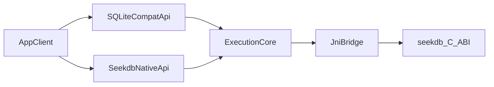

# seekdb-android Architecture and Delivery Design

## 1. Goals

seekdb-android delivers two APIs in one Android library:

- **SQLite-shaped API surface** for Room, existing `android.database.sqlite` users, and apps that today depend on [sqlite-android](https://github.com/requery/sqlite-android) (`io.requery.android.database.sqlite.*` migration path). The long-term target is **feature parity with that stack** (connection pool, windowed cursors, `SQLiteDatabase`/`SQLiteOpenHelper`, hooks/UDF where SeekDB supports them), not merely “Room runs”.
- **SeekDB native API surface** for direct and advanced usage.

**Near-term priority:** keep Room/SupportSQLite green while hardening the compat layer.

**Long-term priority:** converge on **full SQLite capability replacement** at the Java API level (behaviour and surface area aligned with sqlite-android / AOSP SQLite patterns), backed by SeekDB execution and documented gaps where the engine differs from SQLite.

## 2. Non-goals

- No **binary** SQLite C ABI compatibility (`sqlite3_*` link-time or drop-in `libsqlite3.so` replacement is out of scope unless explicitly added as a separate deliverable).
- No SQLite bytecode VM emulation.
- **Per-milestone:** not every SQLite pragma, extension (JSON1, FTS5, …), or OS-specific edge case is guaranteed in early phases; each gap is classified in `compat-contract-matrix.md` and closed over time toward the full-replacement goal.

## 3. High-level Architecture

Core principle: one execution pipeline, two API facades.

## 4. Module and Package Layout

Target repository layout:

- `seekdb-android/`
  - `settings.gradle`
  - `build.gradle`
  - `seekdb-android/build.gradle`
  - `seekdb-android/src/main/AndroidManifest.xml`
  - `seekdb-android/src/main/java/com/oceanbase/seekdb/android/compat/...`
  - `seekdb-android/src/main/java/com/oceanbase/seekdb/android/nativeapi/...`
  - `seekdb-android/src/main/java/com/oceanbase/seekdb/android/core/...`
  - `seekdb-android/src/main/jni/...`
  - `seekdb-android/src/androidTest/...`
  - `docs/seekdb-android/...`

## 5. Runtime Layer Responsibilities

### 5.1 Compat API Layer (Room-facing)

- Provide Android SQLite-like semantics.
- Expose `SupportSQLite*` compatible behavior.
- Translate Room/SQLite patterns to ExecutionCore requests.

### 5.2 Native API Layer (SeekDB-facing)

- Expose strongly typed direct wrappers for key `seekdb_*` capabilities.
- Keep API thin and predictable.
- Share lifecycle and threading guardrails with compat layer.

### 5.3 ExecutionCore

- Connection/session orchestration (evolving toward **pool + serialized writer** semantics comparable to `SQLiteConnectionPool` / `SQLiteSession`).
- Statement lifecycle and parameter normalization.
- Result traversal: move from **eager full materialization** to **step/iterate** + **windowed cursor** (`CursorWindow`-style) to match sqlite-android memory behaviour.
- Unified transaction context handling.
- Error normalization before surfacing to upper layers.

### 5.4 JNI Bridge

- Java/Kotlin object <-> opaque handle (`SeekdbConnection`, `SeekdbStmt`, `SeekdbResult`, `SeekdbValue`).
- Ownership-safe handle release paths.
- Exception mapping from seekdb codes and SQLSTATE.

## 6. Object Lifecycle Contract

- Connection created by `seekdb_connect`, released by `seekdb_disconnect`.
- Result returned by query/execute is caller-owned and must be released via `seekdb_result_free`.
- Value objects allocated by `seekdb_value_alloc` must be released by `seekdb_value_free`.
- Row handles are borrowed views and valid only within result traversal contract.

All wrapper objects must implement deterministic `close()` plus leak-safe finalization strategy.

## 7. Threading and Concurrency

- Global open/close path may rely on native global mutex. Initialize once from library startup path.
- Per-connection operations are treated as non-thread-safe by default.
- Connection pooling or session serialization is implemented in ExecutionCore.
- Thread-local error channels (`seekdb_last_error`, `seekdb_last_error_code`) are only used as fallback diagnostics.

## 8. Error Model

Three sources:

- Return codes (`SEEKDB_ERROR_*`).
- Connection/stmnt error strings (`seekdb_error`, `seekdb_stmt_error`).
- SQLSTATE (`seekdb_sqlstate`, `seekdb_stmt_sqlstate`).

Mapping strategy:

- Compat layer maps to Android SQLite exception hierarchy.
- Native layer returns structured error object with code + message + sqlState.
- All public methods must provide deterministic error surface and no hidden native leaks.

## 9. Type and Binding Strategy

- Use `SeekdbValue` for bind parameters and typed extraction in native layer.
- Compat layer accepts SQLite-style bind methods and normalizes to `SeekdbValue`.
- Explicitly define index conventions:
  - Native layer uses 0-based index aligned with current C ABI behavior.
  - Compat layer accepts SQLite-style usage and converts internally.
- Distinguish NULL vs empty string consistently in both layers.

## 10. Transaction Semantics

- Core operations map to `seekdb_begin`, `seekdb_commit`, `seekdb_rollback`, `seekdb_autocommit`.
- Compat layer supports begin-success-end semantics expected by Android users.
- Transaction failure path must guarantee rollback intent when commit contract is not satisfied.

## 11. Build and Packaging

- Android library module with JNI integration (ndkBuild or CMake).
- AAR includes Java/Kotlin API and required native libs for target ABIs.
- Publish metadata includes compatibility scope and known limitations.

## 12. Test Strategy

- Unit tests for API contracts and argument validation.
- JNI integration tests for lifecycle, error propagation, and memory safety.
- Android instrumentation tests for Room P0 scenarios.
- Compatibility regression suite derived from matrix in `compat-contract-matrix.md`.

## 13. Delivery Phases

- Phase 0: project skeleton and CI bootstrap.
- Phase 1: native core MVP (connect/query/result/tx/error).
- Phase 2: statement and value system.
- Phase 3: SQLite compat layer and Room P0.
- Phase 4: regression, stress, and performance baseline.
- Phase 5: release readiness and publishing.
- **Phase 6 (full SQLite replacement track):** JNI + ExecutionCore support for **incremental result fetch**, **long-lived `SeekdbResult` / cursor**, **interrupt/cancel on execute/step**, and blob/text/typed column contract parity with sqlite-android row reads.
- **Phase 7:** Java surface aligned with sqlite-android: `CursorWindow` / `AbstractWindowedCursor`, `SQLiteConnection` + `SQLiteConnectionPool` + `SQLiteSession`, then `SQLiteDatabase` + `SQLiteOpenHelper` (or a licensed adapter of requery sources with JNI swapped to SeekDB).
- **Phase 8:** Engine capabilities matrix: pragmas, ATTACH, hooks/custom functions, and extensions **as SeekDB exposes them**; remaining SQLite-only features documented as permanent gaps or future engine work.

### 13.1 Alignment reference: sqlite-android

Treat [sqlite-android](https://github.com/requery/sqlite-android) as the **behavioural and structural reference** for the Java layer (package layout, class boundaries, cursor windowing). Implementation options:

1. **Adapter fork (recommended for speed):** reuse Apache-2.0 sqlite-android Java under proper attribution, replace native calls with SeekDB JNI (requires SeekDB C ABI to expose statement step, column metadata, reset, clear bindings, and stable error channels).
2. **Clean-room port:** reimplement the same public shapes on `ExecutionCore` (higher cost, fewer licensing constraints).

### 13.2 SeekDB C ABI prerequisites (for full replacement)

Beyond today’s prepare/bind/execute and `seekdb_result_row_next`, long-term parity typically requires (names illustrative):

- Explicit **statement step** vs one-shot execute, **reset**, **clear bindings**, **bind parameter count/name** where applicable.
- **Result/statement cancel** or cooperative interrupt during long scans.
- Stable **column type** and **BLOB** read paths matching consumer expectations.
- Optional: **update hook / authorizer / progress** if sqlite-android-style callbacks are required.

Engine teams and this module should share a single **ABI parity checklist** versioned with `SEEKDB_ABI_VERSION`.

## 14. Acceptance Criteria

- Both API layers are documented and mapped to execution core.
- Compatibility matrix is complete and actionable.
- Room P0 path has explicit testable criteria.
- Ownership and threading contracts are clear enough for safe implementation.
- **Full-replacement track:** a published **parity checklist** against sqlite-android (classes + critical methods) with Pass / Degraded / N/A (engine limitation) per item, and instrumentation tests that run when `libseekdb.so` is present.
